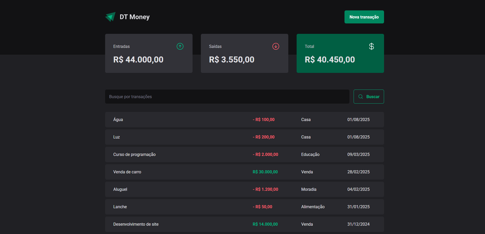
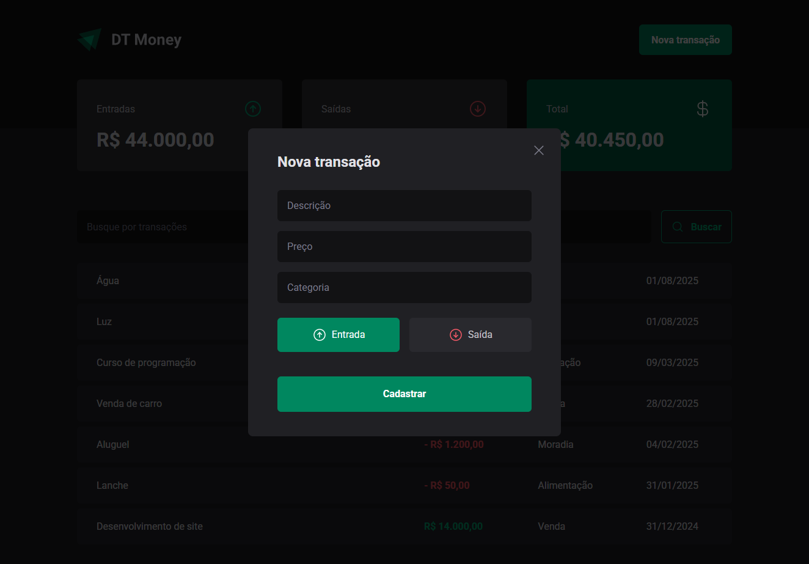

<div align="center">
  
</div>

<p align="center">
  Uma aplicação web para controle financeiro pessoal desenvolvida em React com TypeScript
</p>

<p align="center">
  
  
  
  
</p>

<div align="center">
  <a href="#-sobre">Sobre</a>&nbsp;&nbsp;&nbsp;|&nbsp;&nbsp;&nbsp;
  <a href="#-layout">Layout</a>&nbsp;&nbsp;&nbsp;|&nbsp;&nbsp;&nbsp;
  <a href="#-tecnologias">Tecnologias</a>&nbsp;&nbsp;&nbsp;|&nbsp;&nbsp;&nbsp;
  <a href="#-estrutura-do-projeto">Estrutura</a>&nbsp;&nbsp;&nbsp;|&nbsp;&nbsp;&nbsp;
  <a href="#-funcionalidades">Funcionalidades</a>&nbsp;&nbsp;&nbsp;|&nbsp;&nbsp;&nbsp;
  <a href="#-como-executar">Como executar</a>&nbsp;&nbsp;&nbsp;|&nbsp;&nbsp;&nbsp;
  <a href="#-licença">Licença</a>
</div>

## 💻 Sobre

O **DT Money** é uma aplicação de controle financeiro pessoal desenvolvida com React e TypeScript, onde você pode gerenciar suas transações financeiras, acompanhar entradas e saídas, e ter um resumo completo do seu saldo. O projeto utiliza Styled Components para estilização e Radix UI para componentes acessíveis.

**Status atual:** Funcionalidades principais implementadas - Dashboard com resumo financeiro, listagem de transações e modal para cadastro de novas transações.

### 📈 Últimas atualizações

- ✅ **Dashboard completo** - Resumo com entradas, saídas e total geral
- ✅ **Listagem de transações** - Visualização de todas as transações com destaque por tipo
- ✅ **Modal de nova transação** - Formulário para cadastro de transações
- ✅ **Interface responsiva** - Design adaptativo usando Styled Components
- ✅ **Sistema de busca** - Campo de busca para filtrar transações
- ✅ **Configuração de código** - ESLint configurado para manter qualidade do código
- ✅ **Paths absolutos** - Configuração de imports absolutos para melhor organização

## 🎨 Layout

O layout da aplicação foi baseado no design disponível no Figma:

<a href="https://www.figma.com/design/FYWzJOVbnhrIqUoX2hoea8/DT-Money--Community-?node-id=42078-424&t=S9ZSjdNTzcTWoR4h-0">
  
</a>

<!-- ### 📱 Preview


 -->

## 🚀 Tecnologias

Este projeto foi desenvolvido utilizando as seguintes tecnologias:

- [React](https://reactjs.org/) - Biblioteca para interfaces de usuário
- [TypeScript](https://www.typescriptlang.org/) - Linguagem com tipagem estática
- [Styled Components](https://styled-components.com/) - CSS-in-JS para estilização
- [Radix UI](https://www.radix-ui.com/) - Componentes primitivos acessíveis
- [Phosphor Icons](https://phosphoricons.com/) - Biblioteca de ícones
- [Vite](https://vitejs.dev/) - Build tool e dev server
- [ESLint](https://eslint.org/) - Ferramenta de linting para código

## 📁 Estrutura do Projeto

```
src/
├── @types/           # Tipos TypeScript customizados
│   └── styled.d.ts   # Tipagem do tema do Styled Components
├── assets/           # Assets da aplicação (imagens, ícones)
│   └── logo.svg      # Logo da aplicação
├── components/       # Componentes reutilizáveis
│   ├── Header/       # Cabeçalho com logo e botão de nova transação
│   │   ├── index.tsx
│   │   └── styles.ts
│   ├── Summary/      # Cards de resumo financeiro
│   │   ├── index.tsx
│   │   └── styles.ts
│   └── NewTransactionModal/ # Modal para cadastro de transações
│       ├── index.tsx
│       └── styles.ts
├── pages/            # Páginas da aplicação
│   └── Transactions/ # Página principal com transações
│       ├── index.tsx
│       ├── styles.ts
│       └── components/
│           └── SearchForm/ # Formulário de busca
├── styles/           # Configurações de estilo globais
│   ├── global.ts     # Estilos globais
│   └── themes/
│       └── default.ts # Tema padrão da aplicação
├── App.tsx           # Componente principal
└── main.tsx          # Ponto de entrada da aplicação
```

## ⚡ Funcionalidades

### ✅ Implementadas

- **Dashboard financeiro** - Visualização de entradas, saídas e saldo total
- **Listagem de transações** - Tabela com todas as transações registradas
- **Destaque por tipo** - Cores diferenciadas para entradas (verde) e saídas (vermelho)
- **Modal de cadastro** - Formulário para adicionar novas transações
- **Interface responsiva** - Design que se adapta a diferentes tamanhos de tela
- **Sistema de busca** - Campo para filtrar transações
- **Tema consistente** - Sistema de cores e tipografia unificado
- **Componentes reutilizáveis** - Header, Summary e Modal modulares
- **Paths absolutos** - Imports limpos sem caminhos relativos complexos

### 🧩 Componentes Principais

- **Header** - Cabeçalho com logo e botão para nova transação
- **Summary** - Cards com resumo de entradas, saídas e total
- **NewTransactionModal** - Modal com formulário de cadastro
- **SearchForm** - Formulário de busca de transações
- **TransactionsTable** - Tabela de listagem das transações

### 🚧 Em desenvolvimento

- **Validação de formulários** - React Hook Form para controle e validação
- **Persistência de dados** - Integração com API ou localStorage
- **Categorização de transações** - Sistema de categorias para organização
- **Filtros avançados** - Filtros por data, categoria e valor
- **Gráficos e relatórios** - Visualizações gráficas dos dados financeiros
- **Exportação de dados** - Funcionalidade para exportar relatórios

### 💡 Próximas funcionalidades

- **Metas financeiras** - Sistema de definição e acompanhamento de metas
- **Notificações** - Alertas para gastos e lembretes
- **Modo escuro/claro** - Toggle entre temas
- **Backup e sincronização** - Sincronização entre dispositivos

## 🔧 Como executar

### Pré-requisitos

Antes de começar, você vai precisar ter instalado em sua máquina:

- [Git](https://git-scm.com/)
- [Node.js](https://nodejs.org/en/) (versão 16 ou superior)
- [npm](https://www.npmjs.com/) ou [yarn](https://yarnpkg.com/)

### 🎲 Rodando a aplicação

```bash
# Clone este repositório
$ git clone https://github.com/elenmagalhaes/dt-money-web.git

# Acesse a pasta do projeto no terminal/cmd
$ cd dt-money-web

# Instale as dependências
$ npm install
# ou
$ yarn install

# Execute a aplicação em modo de desenvolvimento
$ npm run dev
# ou
$ yarn dev

# O servidor inciará na porta:5173 - acesse http://localhost:5173
```

### 🏗️ Build para produção

```bash
# Gerar build otimizado
$ npm run build
# ou
$ yarn build

# Visualizar build localmente
$ npm run preview
# ou
$ yarn preview
```

## 📝 Licença

Este projeto está sob a licença MIT. Veja o arquivo [LICENSE](LICENSE) para mais detalhes.

---

Desenvolvido com ❤️ por Elen Magalhães

[](https://www.linkedin.com/in/ecmrodrigues)
[](https://github.com/elenmagalhaes)

Feito com 💜 no desafio Ignite da [Rocketseat](https://rocketseat.com.br/) 🚀
